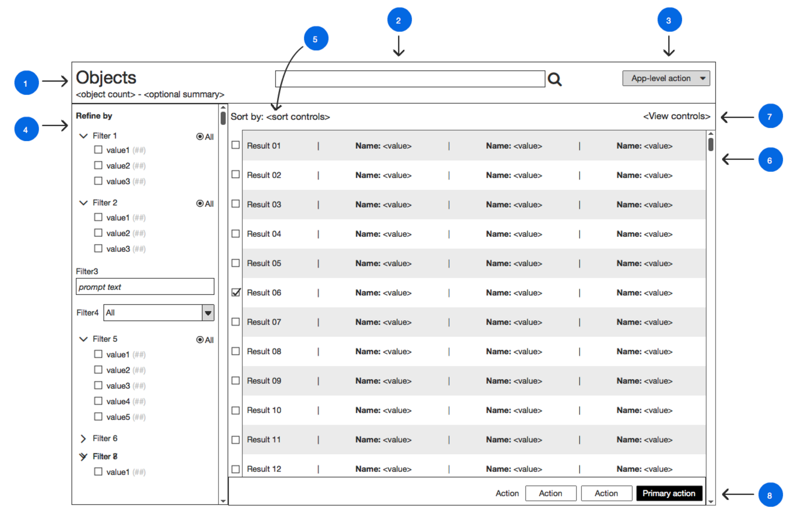

[ci-img]: https://img.shields.io/travis/ciena-blueplanet/ember-block-slots.svg "Travis CI Build Status"
[ci-url]: https://travis-ci.org/ciena-blueplanet/ember-block-slots
[cov-img]: https://img.shields.io/coveralls/ciena-blueplanet/ember-block-slots.svg "Coveralls Code Coverage"
[cov-url]: https://coveralls.io/github/ciena-blueplanet/ember-block-slots
[eo-img]: https://emberobserver.com/badges/ember-block-slots.svg
[eo-url]: https://emberobserver.com/addons/ember-block-slots

# ember-block-slots <br />

[![Travis][ci-img]][ci-url] [![Coveralls][cov-img]][cov-url] [![Ember Observer][eo-img]][eo-url]

Adds contextual **layout** to component interfaces.

**[Demo](http://ciena-blueplanet.github.io/ember-block-slots)**

### Why does this matter?

#### *"I know why this matters, take me straight to the [usage](#usage)*"

Ember has a number of tools for component authors: a yield, block params, contextual components 
and block defaults (else/inverse).  However, since only a single yield is available, Ember does 
*not* provide a way for component authors to hide complex layouts behind a component interface.
For authors of higher-order components this is a problem.

#### Designing higher-order components (patterns of composite components)

Suppose you want to create a higher-order component that acts as an inventory browser.



You want to arrange a title bar on the top of the page, a filter pane on the left and a list
on the right.  The title bar can be customized with summary information (text, badges, graphs) 
and contexual actions (e.g. keyword search, add).  The filter pane needs to be wired to the list,
but filtering should be handled in the route/controller.  The list has a set of potential controls
(e.g. sort, paginate, expand/collapse) and contextual actions based on the items selected that
should also be handled in the route/controller.

##### There are two choices available

The first choice is to **pre-select all the components** (e.g. form, list, buttons, links, graphs) 
to fill these roles and proxy the relevant properties through the component interface, modifying 
the interface whenever additional features are available.  Maybe your underlying components are 
stable and maybe your feature set never expands, but don't bet the house on it; it's more likely
that you'll need to rev and release your component based on the progression of the components you
select.  This means **a lot of maintenance and a broad interface** - not ideal.

The second choice is to **loosely couple the components, providing a number of CSS classes** and rely
on the consumer to wrap the components in the correct HTML to layout the pattern as required.
This works fine for a single instance, but **before you know it there are 10 instances of the pattern** 
in your product and as the design team keeps making minor (or major) tweaks **and each of your browsers
is starting to look a bit different...**

#### Alright, I lied, there is a third choice

You use this addon :wink:

With multiple yield targets available, you're now able to combine the structured DOM from the first choice
with the loose coupling of the second choice.  **Now consumers of the addon don't need to worry about:** 
- **Layout changes** *"Oh look, the design team made the title bar a footer..."*
- **Component updates** *"Lists now support pagination!...but this component hasn't upgraded..."*
- **Proxying actions** *"But I really need 10 contextual action buttons/links in this case..."*

### Seems promising, how does this work?

### Installation

ember install ember-block-slots

### Usage

Import and apply the SlotsMixin in the component where you want to provide multiple yield slots.

```js
import Ember from 'ember'
import SlotsMixin from 'ember-block-slots'

export default Ember.Component.extend(SlotsMixin, {
```

In the component template, yield once to allow instances to register block slots, then provide 
one or more named yield slots

```hbs
{{yield}}

{{#yield-slot 'name'}}
  <div class='surrounding-layout'>
    {{yield}}
  </div>
{{/yield-slot}}
```

When using the component, target content for the yield slots using block slots

```hbs
{{#pattern-component}}
  {{#block-slot 'name'}}
    <div>Content for the yield</div>
  {{/block-slot}}
{{/pattern-component}}
```

Of course, this is only a glimpse at the interface designs now available to you.  Block slots also support:
- Defaults per slot (e.g. http://codingvalue.com/blog/ember-inverse-yield/)
- Conditional slots (e.g. https://guides.emberjs.com/v2.6.0/templates/conditionals/)
- Block params per slot (e.g. https://guides.emberjs.com/v2.6.0/components/block-params/)
 - Positional params (e.g. https://guides.emberjs.com/v2.6.0/components/passing-properties-to-a-component/#toc_positional-params)
 - Hash params (e.g. http://emberjs.com/api/classes/Ember.Templates.helpers.html#method_hash)
 - Contextual components (e.g. https://guides.emberjs.com/v2.6.0/components/wrapping-content-in-a-component/#toc_sharing-component-data-with-its-wrapped-content)
 - Closure actions (e.g. http://alexdiliberto.com/posts/ember-closure-actions/)
- Access to properties/actions from the controller/route scope (e.g. https://guides.emberjs.com/v2.6.0/templates/handlebars-basics/#toc_displaying-properties)
- Chained yields (yielding to another component inside the pattern component)

See the **[demo](http://ciena-blueplanet.github.io/ember-block-slots)** for additional syntax and examples.

### Issues/requests

Found a corner case?  Thought of a design pattern we haven't listed?
PRs and issues are welcome!

### Contributing

This project uses pr-bumper https://github.com/ciena-blueplanet/pr-bumper to publish to npm - add a semver comment in your PR in the following format: #fix# / #minor# / #major#

We also lint the project using eslint - to check for errors and fix basic style issues run `./node_modules/.bin/eslint . --fix` in the root of the project (probably a better command for this)

### Credits

Thanks to [@runspired](https://twitter.com/Runspired) for the initial inspiration for this implementation.
